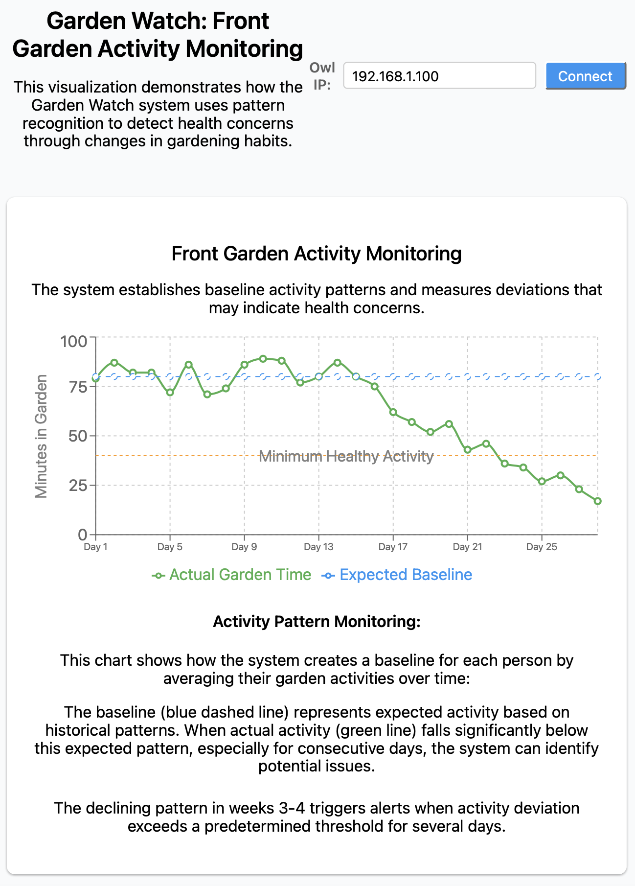

# ESP32 Owl Companion

An interactive owl statue project powered by ESP32-C3, featuring motion, light, sound, and haptic feedback.


## Garden Watch Visualization

The Garden Watch system monitors garden activity patterns to detect potential health concerns.



## Overview

This project combines art and technology to create an interactive steel owl statue with the following capabilities:
- Head nodding motion via servo
- LED illuminated eyes with WS2812B rings
- Sound playback (owl hooting)
- Vibration haptic feedback
- Battery powered operation with deep sleep support
- HTTP-based remote control

The owl is designed with a detachable head that connects via magnetic pogo pins, allowing for modular design and easy maintenance. The statue features a bronze/copper-colored finish with a modern interpretative design.

## Hardware Components

The project uses the following main components:
- **M5Stamp C3U**: ESP32-C3 RISC-V MCU controller module with Wi-Fi
- **StampTimerPower**: Power management module with battery charging, RTC, and power control
- **WS2812B LED Rings** (optional): 8-LED 5V rings for the owl's eyes
- **MAX98357A Amplifier**: I2S audio amplifier for the speaker
- **28mm Speaker**: For sound output
- **Vibration Motor**: DC 3V-6V, 32mA for haptic feedback
- **Servo Motor**: For head nodding motion (15° forward, 10° back)
- **4-pin Magnetic Pogo Connector**: For detachable head connection
- **LiPo Battery**: 3.7V 1000mAh with JST connector
- **Slide Switch**: For power control

See the [Bill of Materials](docs/hardware/bill_of_materials.md) for a complete parts list.

## Physical Design

### Owl Statue Specifications
- **Total Height**: 200mm
- **Head Diameter**: 100mm
- **Body Top Diameter**: 75mm
- **Materials**: Steel with bronze/copper-colored finish
- **Features**:
  - Detachable head via magnetic connection
  - Decorative base with radiating support legs
  - Contrasting black interior
  - Bowl-shaped body design
  - Large circular eye cutouts with LED illumination

## System Architecture

The system uses a dual voltage design (3.3V and 5V) with the following subsystems:

### Power System
- Battery charging via TP4057 on StampTimerPower
- 3.3V DCDC output for M5Stamp C3U
- 5V boost circuit for peripherals
- USB Type-C charging port
- Battery protection circuit

### Head Section
- WS2812B LED rings powered by 5V (optional component, can be omitted if visual feedback is not needed)
- 4-pin magnetic pogo connector:
  - Pin 1: 5V (LED power)
  - Pin 2: GND (Common ground)
  - Pin 3: LED Data (3.3V)
  - Pin 4: Sensing/Head detection

### Body Section
- Motion system with servo motor for nodding
- Audio system with MAX98357A amplifier and 28mm speaker
- Vibration motor controlled via MOSFET
- Power management and control logic

### GPIO Assignment
```
ESP32-C3 GPIO Mapping:
GPIO2  → LED Ring Data (3.3V) [Optional - only if LED rings are installed]
GPIO6  → I2S BCLK
GPIO7  → I2S LRCLK
GPIO8  → I2S DIN
GPIO4  → Motor MOSFET (3.3V)
GPIO18 → I2C SDA (RTC)
GPIO19 → I2C SCL (RTC)
GPIO9  → Built-in Button
GPIO5  → Head Detection
GPIO10 → Servo Control
```



## API Endpoints

The owl robot provides a comprehensive RESTful API for controlling all aspects of its functionality:

### API Endpoint Overview

| Endpoint | Method | Description |
|----------|--------|-------------|
| `/` | GET | Root endpoint that confirms server is running |
| `/api/status` | GET | Returns owl robot status including battery level and alert state |
| `/api/hourly-data` | POST | Receives hourly activity data from sensor modules |
| `/api/control/motion` | POST | Controls the nodding motion of the owl's head |
| `/api/control/vibration` | POST | Activates the vibration motor for haptic feedback |
| `/api/control/audio` | POST | Triggers sound playback |
| `/api/control/led` | POST | Controls the LED color |
| `/api/action` | POST | Activates the owl's action mode directly |
| `/api/data/activity` | GET | Returns garden activity data with baseline and deviation analysis |
| `/api/data/daily-patterns` | GET | Returns daily activity pattern data for healthy vs. current behavior |
| `/api/data/weekly-tasks` | GET | Returns weekly garden task completion data |
| `/api/data/deviation` | GET | Returns detailed deviation score analysis |
| `/api/data/reminders` | GET | Returns data on response times to garden care reminders |

### Detailed API Reference

#### 1. Status Endpoint

Get the current status of the owl robot:

```bash
curl http://[OWL_IP_ADDRESS]/api/status
```

Example response:
```json
{
  "status": "online",
  "batteryVoltage": 3.85,
  "recentActivity": 0.75,
  "alertActive": false
}
```

#### 2. Hourly Data Endpoint

Send hourly activity data:

```bash
curl -X POST \
  http://[OWL_IP_ADDRESS]/api/hourly-data \
  -H 'Content-Type: application/json' \
  -d '{
    "timestamp": "2025-03-28 14:30:00",
    "hour": 14,
    "day": 5,
    "detectionCount": 12,
    "totalReadings": 15,
    "maxDetectionPoints": 8,
    "avgDetectionPoints": 3.5,
    "presenceRatio": 0.8
  }'
```

Parameters:
| Field | Type | Description |
|-------|------|-------------|
| `timestamp` | string | ISO formatted date and time when the hour period started |
| `hour` | integer | Hour of day (0-23) of the data collection period |
| `day` | integer | Day of week (0=Sunday, 1=Monday, ..., 6=Saturday) |
| `detectionCount` | integer | Number of readings that detected human presence |
| `totalReadings` | integer | Total number of sensor readings taken during the hour |
| `maxDetectionPoints` | integer | Maximum number of detection points recorded in any single reading |
| `avgDetectionPoints` | float | Average number of detection points across all readings |
| `presenceRatio` | float | Ratio of readings with detected presence to total readings (0.0-1.0) |

#### 3. Motion Control Endpoint

Control the nodding motion:

```bash
curl -X POST \
  http://[OWL_IP_ADDRESS]/api/control/motion \
  -H 'Content-Type: application/json' \
  -d '{
    "angle": 15,
    "duration": 1000,
    "immediate": false
  }'
```

Parameters:
- `angle`: Nodding angle in degrees (1-30)
- `duration`: Duration to hold the position in milliseconds
- `immediate`: If true, moves immediately; if false, uses smooth animation

#### 4. Vibration Control Endpoint

Activate haptic feedback:

```bash
curl -X POST \
  http://[OWL_IP_ADDRESS]/api/control/vibration \
  -H 'Content-Type: application/json' \
  -d '{
    "intensity": 50,
    "duration": 500
  }'
```

Parameters:
- `intensity`: Vibration intensity (1-100)
- `duration`: Duration in milliseconds (50-2000)

#### 5. Audio Control Endpoint

Play sounds:

```bash
curl -X POST \
  http://[OWL_IP_ADDRESS]/api/control/audio \
  -H 'Content-Type: application/json' \
  -d '{
    "pattern": "hoot",
    "volume": 75
  }'
```

Parameters:
- `pattern`: Sound pattern to play ("hoot" or "reminder")
- `volume`: Volume level (1-100)

#### 6. LED Control Endpoint

Control the LED color:

```bash
curl -X POST \
  http://[OWL_IP_ADDRESS]/api/control/led \
  -H 'Content-Type: application/json' \
  -d '{
    "r": 255,
    "g": 0,
    "b": 0,
    "w": 0,
    "duration": 5000
  }'
```

Parameters:
- `r`, `g`, `b`, `w`: RGB+W color values (0-255)
- `duration`: Duration in milliseconds (0 for indefinite)

#### 7. Action Mode Endpoint

Trigger action mode directly:

```bash
curl -X POST http://[OWL_IP_ADDRESS]/api/action
```

Response:
```json
{
  "status": "ok",
  "message": "Action mode activated"
}
```

#### 8. Garden Activity Data Endpoint

Get garden activity metrics:

```bash
curl http://[OWL_IP_ADDRESS]/api/data/activity
```

Example response (abbreviated):
```json
[
  {
    "day": "Day 1",
    "actualActivity": 75,
    "baselineActivity": 80,
    "deviationScore": 0.25,
    "alert": false
  },
  {
    "day": "Day 2",
    "actualActivity": 78,
    "baselineActivity": 80,
    "deviationScore": 0.33,
    "alert": false
  },
  ... additional days ...
]
```

#### 9. Daily Activity Patterns Endpoint

Get daily activity pattern data:

```bash
curl http://[OWL_IP_ADDRESS]/api/data/daily-patterns
```

Example response (abbreviated):
```json
{
  "healthy": [
    {
      "hour": "0:00",
      "activity": 5
    },
    ... additional hours ...
  ],
  "current": [
    {
      "hour": "0:00",
      "activity": 20,
      "expectedActivity": 5
    },
    ... additional hours ...
  ]
}
```

#### 10. Weekly Task Completion Endpoint

Get weekly garden task completion data:

```bash
curl http://[OWL_IP_ADDRESS]/api/data/weekly-tasks
```

Example response (abbreviated):
```json
{
  "healthy": [
    {
      "day": "Mon",
      "tasksCompleted": 5,
      "gardenTime": 45
    },
    ... additional days ...
  ],
  "current": [
    {
      "day": "Mon",
      "tasksCompleted": 1,
      "gardenTime": 15
    },
    ... additional days ...
  ]
}
```

#### 11. Deviation Score Endpoint

Get detailed deviation score analysis:

```bash
curl http://[OWL_IP_ADDRESS]/api/data/deviation
```

Example response (abbreviated):
```json
[
  {
    "day": "Day 1",
    "deviationScore": 0.25,
    "alert": false
  },
  {
    "day": "Day 2",
    "deviationScore": 0.33,
    "alert": false
  },
  ... additional days ...
]
```

#### 12. Reminder Response Endpoint

Get response time data for garden care reminders:

```bash
curl http://[OWL_IP_ADDRESS]/api/data/reminders
```

Example response:
```json
[
  {
    "week": "Week 1",
    "responseTime": 12,
    "alert": false
  },
  {
    "week": "Week 2",
    "responseTime": 15,
    "alert": false
  },
  {
    "week": "Week 3",
    "responseTime": 35,
    "alert": true
  },
  {
    "week": "Week 4",
    "responseTime": 42,
    "alert": true
  }
]
```